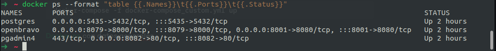

# Comandos

#### Tamaño que ocupa Docker

```
docker system df -v
```

#### Exportar imagen

```
docker save myimage:latest | gzip > myimage\_latest.tar.gz
```

#### Importar imagen

```
docker load < busybox.tar.gz
```

#### Copiar del host al contenedor

```
docker cp ./some\_file CONTAINER:/work
```

#### Copiar del contenedor al host

```
docker cp CONTAINER:/var/logs/ /tmp/app\_logs
```

#### Detener todos los contenedores

```
docker stop $(docker ps -q)
```

#### Eliminar todos los contenedores

```
docker rm $(docker ps -a -q)
```

**Tamaño utilizado por imagen**

```
docker images --format "{{.ID}}\t{{.Size}}\t{{.Repository}}" | sort -k 2 -h
```

**Ejecutar compose con nombre diferente al estandar** <mark style="color:blue;">docker-compose.yml</mark>

```
docker-compose -f docker-compose_custom.yml up
```

<mark style="color:green;">**Docker ps**</mark>** con datos generales**

```
docker ps --format "table {{.Names}}\t{{.Ports}}\t{{.Status}}"
```

<figure><figcaption></figcaption></figure>
